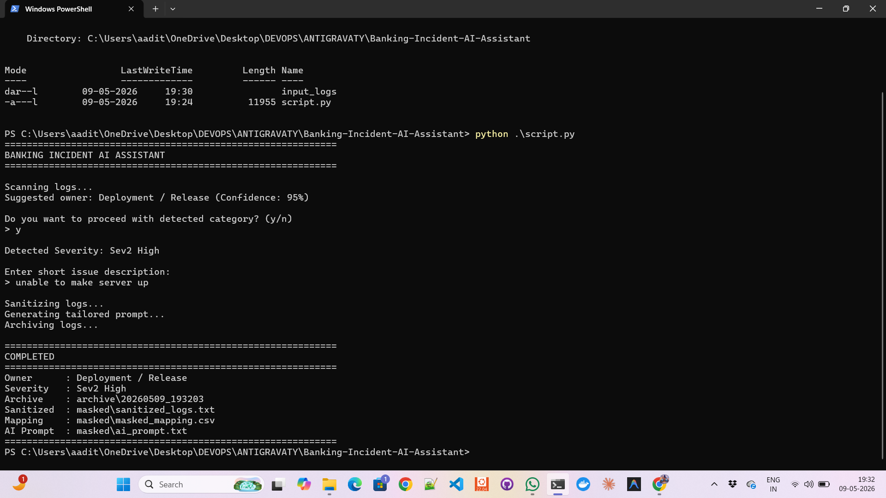
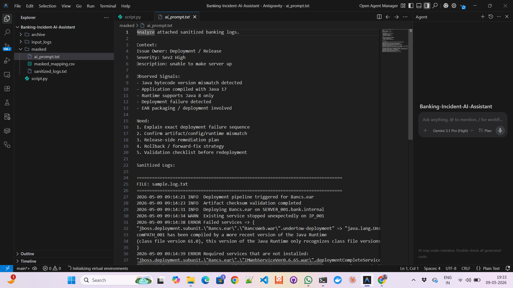
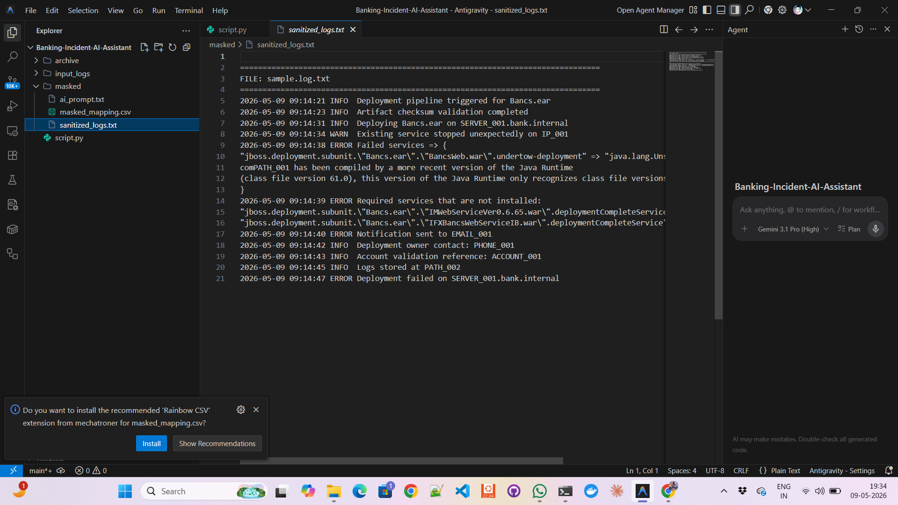
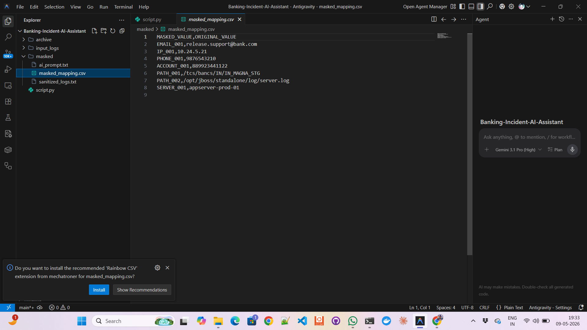
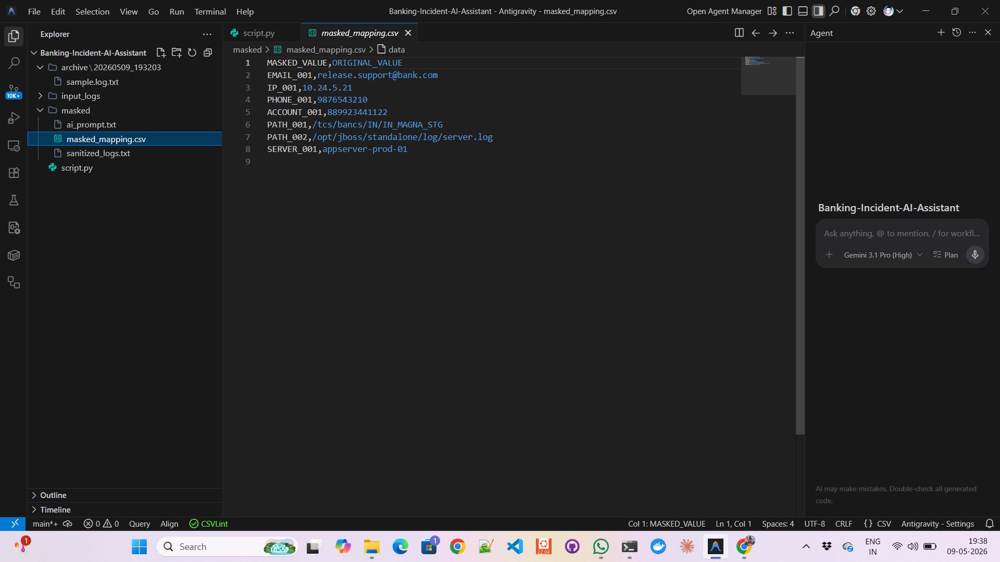
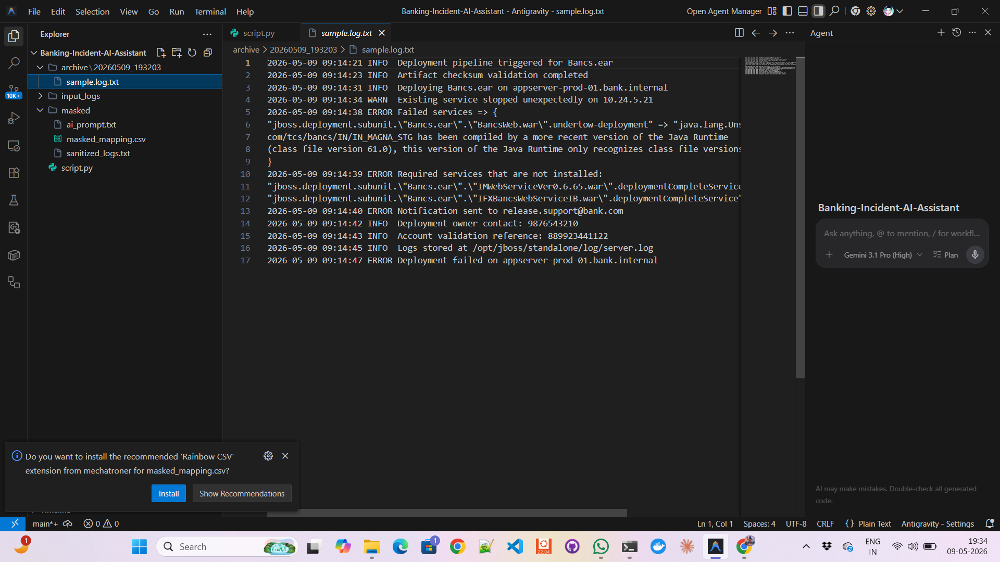

# Banking Incident AI Assistant

AI-assisted log sanitization and incident triage utility built for banking middleware / enterprise deployment analysis.

## Overview
This tool helps engineering teams quickly sanitize sensitive logs and generate context-aware AI prompts for faster root cause analysis (RCA).

The script:
- Reads raw incident logs
- Detects probable issue owner
- Classifies severity
- Sanitizes sensitive data
- Creates masking map
- Generates AI-ready tailored prompt
- Archives original logs

## Features
### Auto Detection
Automatically suggests probable owner:
- Testing / QA
- Development
- Deployment / Release
- Server Management / Infra
- Database
- Network

### Severity Detection
Severity classification:
- Sev1 Critical
- Sev2 High
- Sev3 Medium
- Sev4 Low

### Sensitive Data Masking
Masks:
- Email IDs
- IP addresses
- Phone numbers
- Account numbers
- File paths
- Hostnames / server names

Example:

Raw:
CustomerID=88992344
IP=10.24.5.21

Sanitized:
CustomerID=ACCOUNT_001
IP=IP_001

### Dynamic Prompt Generation
Creates issue-specific AI prompt using:
- detected owner
- severity
- user description
- actual log findings

### Output Files
masked/
├── sanitized_logs.txt
├── masked_mapping.csv
└── ai_prompt.txt

archive/
└── timestamp/

## Tech Stack
- Python 3
- Regex
- CSV
- File Handling
- Log Parsing
- Prompt Engineering

## Usage
```bash
python3 script.py
```

## Workflow
1. Put logs in `input_logs/`
2. Run script
3. Confirm detected category
4. Add short description
5. Receive:
   - Sanitized logs
   - Mapping file
   - AI prompt
   - Archived original logs

## Use Cases
- Production incidents
- Deployment failures
- Middleware RCA
- Banking release validation
- AI-assisted troubleshooting

## Demo

### Terminal Run


### Generated Prompt


### Sanitized Output


### Masked Mapping


### CSV File


### Logs


## Author
Aaditya Acharya
Deployment Engineer | DevOps | Banking Technology
